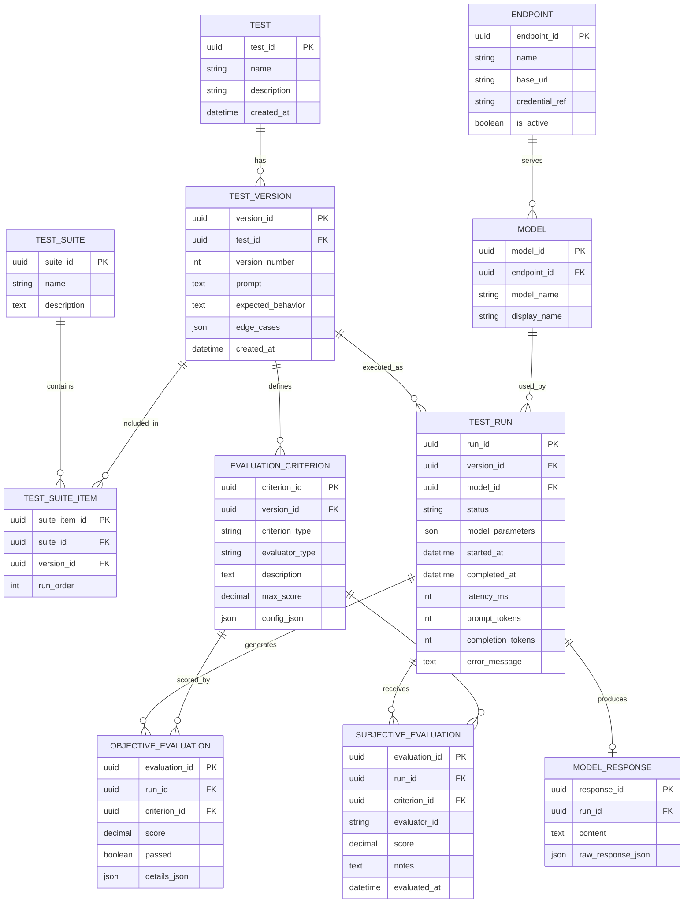

# Preliminary Data Model

> **Status:** Preliminary / subject to change. This model is intended to give the team a shared starting point for the Week 5 prototype. It is based on the current capstone requirements and should be refined as implementation decisions are confirmed with the Microsoft mentor.

## Goal

The purpose of this model is to define the main information the harness needs to remember and how those pieces relate to one another. In particular, it connects test creation and versioning to model execution, saved responses, automated scoring, human scoring, and endpoint/model configuration.

## ER Diagram



## Entity Responsibilities

| Entity | Purpose |
| --- | --- |
| `TEST` | Represents the overall test created in the harness. |
| `TEST_VERSION` | Stores a specific version of a test's prompt, expected behavior, and edge cases so previous runs remain reproducible. |
| `TEST_SUITE` | Represents a named group of tests that can be executed together. |
| `TEST_SUITE_ITEM` | Connects a test suite to specific test versions and preserves execution order. |
| `EVALUATION_CRITERION` | Defines how a test version should be evaluated, including objective or subjective criteria and any evaluator configuration. |
| `ENDPOINT` | Represents a configurable OpenAI-compatible API endpoint. The database should store a reference to credentials rather than raw secrets. |
| `MODEL` | Represents a model available through an endpoint. |
| `TEST_RUN` | Represents one execution of one test version against one model and stores run configuration, timing, usage, status, and errors. |
| `MODEL_RESPONSE` | Stores the model output and, where useful, the raw API response for the run. |
| `OBJECTIVE_EVALUATION` | Stores automatically calculated results for objective criteria. |
| `SUBJECTIVE_EVALUATION` | Stores human-entered ratings and notes for subjective criteria. |

## Example Test-Run Lifecycle

A single run would move through the model roughly like this:

```text
TEST
  ↓
TEST_VERSION
  ├── prompt
  ├── expected behavior
  └── evaluation criteria
        ↓
TEST_RUN ───── MODEL ───── ENDPOINT
  ↓
MODEL_RESPONSE
  ↓
OBJECTIVE_EVALUATION
  +
SUBJECTIVE_EVALUATION
```

Example:

```text
Test: "Logic Reasoning Test"
  ↓
Version 1: "Solve the following puzzle..."
  ↓
Run against Model A through Endpoint X
  ↓
Response saved
  ↓
Objective criteria scored automatically
  ↓
Optional human ratings/notes saved
```

## Prototype-Relevant Data Flow

For the first mini prototype, the minimum useful path is:

```text
Test Version
    ↓
Test Run
    ↓
Model Response
    ↓
Structured JSON Result
    ↓
PostgreSQL
```

The objective/subjective evaluation tables can then be connected as scoring functionality is added.

## Current Assumptions / Open Questions

This diagram intentionally does **not** settle every design decision. The following should be confirmed as the project evolves:

- Whether PostgreSQL will be the application's primary persistence layer or mainly the destination for imported JSON results.
- Whether test suites should point to exact test versions, as shown here, or automatically use a test's latest version.
- Whether objective and subjective results should remain separate tables or eventually share a generalized evaluation-result structure.
- Which evaluator types will be supported and what belongs in `config_json`.
- Whether authentication/users need to become first-class database entities.
- How Azure-managed secrets or another secret store will map to `credential_ref`.
- Which run metadata fields are guaranteed across all OpenAI-compatible endpoints.
